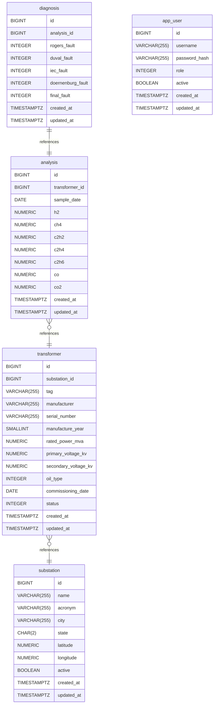

# Tensio documentation
## Summary

- [Introduction](#introduction)
- [Database Type](#database-type)
- [Table Structure](#table-structure)
	- [substation](#substation)
	- [transformer](#transformer)
	- [analysis](#analysis)
	- [diagnosis](#diagnosis)
	- [app_user](#app_user)
- [Relationships](#relationships)
- [Database Diagram](#database-diagram)

## Introduction

## Database type

- **Database system:** PostgreSQL
## Table structure

### substation
Electrical substations that host transformers

| Name           | Type          | Settings                       | References | Note                                                         |
| -------------- | ------------- | ------------------------------ | ---------- | ------------------------------------------------------------ |
| **id**         | BIGINT        | 🔑 PK, not null, autoincrement |            | Substation primary key                                       |
| **name**       | VARCHAR(255)  | null                           |            | Substation full name                                         |
| **acronym**    | VARCHAR(255)  | not null                       |            | Unique operational code/acronym of the substation            |
| **city**       | VARCHAR(255)  | null                           |            | City where the substation is located                         |
| **state**      | CHAR(2)       | null                           |            | Two-letter state code                                        |
| **latitude**   | NUMERIC(9,7)  | null                           |            | Geographic latitude, decimal degrees (7 decimal places)      |
| **longitude**  | NUMERIC(10,7) | null                           |            | Geographic longitude, decimal degrees (7 decimal places)     |
| **active**     | BOOLEAN       | not null, default: TRUE        |            | Soft-activation flag; FALSE means the substation is disabled |
| **created_at** | TIMESTAMPTZ   | not null                       |            | Record creation timestamp (set by the backend)               |
| **updated_at** | TIMESTAMPTZ   | not null                       |            | Record last-update timestamp (set by the backend)            |

### transformer
Power transformers monitored for condition assessment

| Name                     | Type         | Settings                       | References                | Note                                                                                       |
| ------------------------ | ------------ | ------------------------------ | ------------------------- | ------------------------------------------------------------------------------------------ |
| **id**                   | BIGINT       | 🔑 PK, not null, autoincrement |                           | Transformer primary key                                                                    |
| **substation_id**        | BIGINT       | not null                       | substation_transformer_fk | FK to the substation that hosts this transformer                                           |
| **tag**                  | VARCHAR(255) | not null, unique               |                           | Unique asset tag/operational identifier                                                    |
| **manufacturer**         | VARCHAR(255) | null                           |                           | Manufacturer name                                                                          |
| **serial_number**        | VARCHAR(255) | not null                       |                           | Unique manufacturer serial number                                                          |
| **manufacture_year**     | SMALLINT     | null                           |                           | Year of manufacture                                                                        |
| **rated_power_mva**      | NUMERIC(8,2) | null                           |                           | Rated power in MVA                                                                         |
| **primary_voltage_kv**   | NUMERIC(6,2) | null                           |                           | Rated primary (high) voltage in kV                                                         |
| **secondary_voltage_kv** | NUMERIC(6,2) | null                           |                           | Rated secondary (low) voltage in kV                                                        |
| **oil_type**             | INTEGER      | not null                       |                           | Insulating oil type; enum code mapped by the backend (mineral/vegetable/ester)             |
| **commissioning_date**   | DATE         | null                           |                           | Date the transformer entered operation                                                     |
| **status**               | INTEGER      | not null                       |                           | Operational status; enum code mapped by the backend (operation/maintenance/decommissioned) |
| **created_at**           | TIMESTAMPTZ  | not null                       |                           | Record creation timestamp (set by the backend)                                             |
| **updated_at**           | TIMESTAMPTZ  | not null                       |                           | Record last-update timestamp (set by the backend)                                          |

#### Indexes
| Name                | Unique | Columns      |
| ------------------- | ------ | ------------ |
| transformer_index_0 |        | manufacturer |
| transformer_index_1 |        | status       |

### analysis
Dissolved gas analysis (DGA) samples taken from a transformer main tank

| Name               | Type         | Settings                       | References              | Note                                                               |
| ------------------ | ------------ | ------------------------------ | ----------------------- | ------------------------------------------------------------------ |
| **id**             | BIGINT       | 🔑 PK, not null, autoincrement |                         | Analysis primary key                                               |
| **transformer_id** | BIGINT       | not null                       | analysis_transformer_fk | FK to the sampled transformer                                      |
| **sample_date**    | DATE         | not null                       |                         | Date the oil sample was collected                                  |
| **h2**             | NUMERIC(8,2) | null                           |                         | Hydrogen concentration in ppm                                      |
| **ch4**            | NUMERIC(8,2) | null                           |                         | Methane concentration in ppm                                       |
| **c2h2**           | NUMERIC(8,2) | null                           |                         | Acetylene concentration in ppm                                     |
| **c2h4**           | NUMERIC(8,2) | null                           |                         | Ethylene concentration in ppm                                      |
| **c2h6**           | NUMERIC(8,2) | null                           |                         | Ethane concentration in ppm                                        |
| **co**             | NUMERIC(8,2) | null                           |                         | Carbon monoxide concentration in ppm (paper degradation indicator) |
| **co2**            | NUMERIC(8,2) | null                           |                         | Carbon dioxide concentration in ppm (paper degradation indicator)  |
| **created_at**     | TIMESTAMPTZ  | not null                       |                         | Record creation timestamp (set by the backend)                     |
| **updated_at**     | TIMESTAMPTZ  | not null                       |                         | Record last-update timestamp (set by the backend)                  |

### diagnosis
Fault diagnosis derived from a single DGA analysis

| Name                  | Type        | Settings                       | References            | Note                                                                                    |
| --------------------- | ----------- | ------------------------------ | --------------------- | --------------------------------------------------------------------------------------- |
| **id**                | BIGINT      | 🔑 PK, not null, autoincrement | diagnosis_analysis_fk | Diagnosis primary key                                                                   |
| **analysis_id**       | BIGINT      | not null, unique               |                       | FK to the source analysis (one diagnosis per analysis)                                  |
| **rogers_fault**      | INTEGER     | null                           |                       | Fault code from Rogers Ratio method; enum code mapped by the backend                    |
| **duval_fault**       | INTEGER     | null                           |                       | Fault code from Duval Triangle method; enum code mapped by the backend                  |
| **iec_fault**         | INTEGER     | null                           |                       | Fault code from IEC ratio method; enum code mapped by the backend                       |
| **doernenburg_fault** | INTEGER     | null                           |                       | Fault code from Doernenburg Ratio method; enum code mapped by the backend               |
| **final_fault**       | INTEGER     | null                           |                       | Final fault code from the backend weighted calculation; enum code mapped by the backend |
| **created_at**        | TIMESTAMPTZ | not null                       |                       | Record creation timestamp (set by the backend)                                          |
| **updated_at**        | TIMESTAMPTZ | not null                       |                       | Record last-update timestamp (set by the backend)                                       |

### app_user
Application users for in-app authentication and authorization

| Name              | Type         | Settings                       | References | Note                                                    |
| ----------------- | ------------ | ------------------------------ | ---------- | ------------------------------------------------------- |
| **id**            | BIGINT       | 🔑 PK, not null, autoincrement |            | user primary key                                        |
| **username**      | VARCHAR(255) | not null                       |            | Unique login username                                   |
| **password_hash** | VARCHAR(255) | not null                       |            | Hashed password                                         |
| **role**          | INTEGER      | not null                       |            | User role; enum code mapped by the backend (USER/ADMIN) |
| **active**        | BOOLEAN      | not null, default: TRUE        |            | Whether the account is enabled                          |
| **created_at**    | TIMESTAMPTZ  | not null                       |            | Record creation timestamp (set by the backend)          |
| **updated_at**    | TIMESTAMPTZ  | not null                       |            | Record last-update timestamp (set by the backend)       |

## Relationships

- **transformer to substation**: many_to_one
- **analysis to transformer**: many_to_one
- **diagnosis to analysis**: one_to_one

## Database Diagram

Credits: https://www.drawdb.app/editor